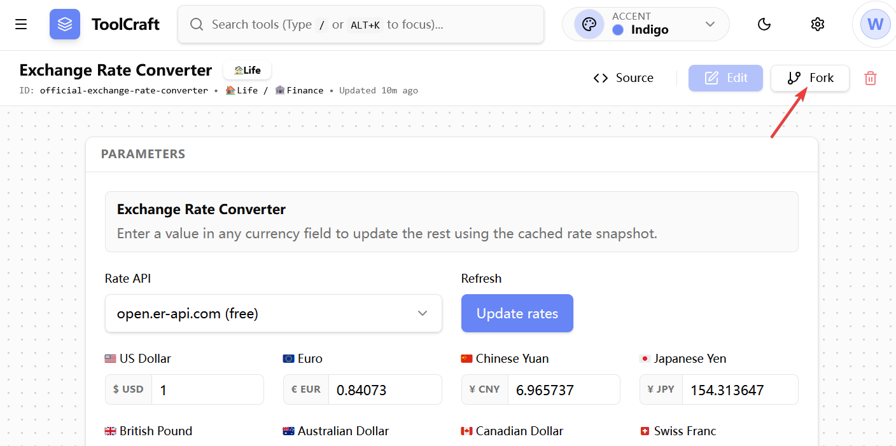
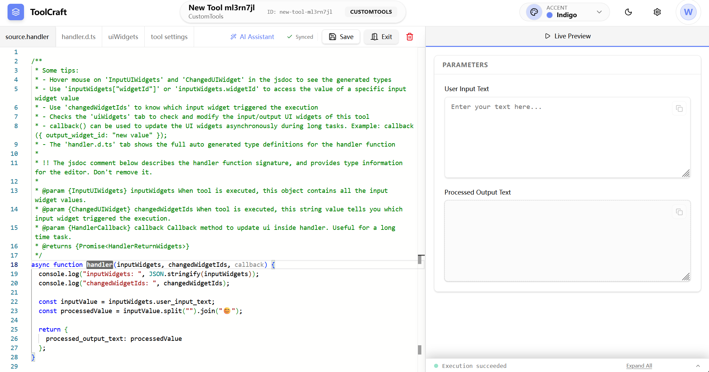

# Basic Concepts

## Tool Types

There are two types of tools in ToolBake:

- Official Tools
- Custom Tools

### Official Tools

Official tools are built-in tools of ToolBake. All tools with the `OFFICIAL` label listed at the top of the sidebar are official tools.

ToolBake comes with a wide variety of built-in official tools, including:

- Common development tools
- Video/audio processing and editing tools
- Image processing tools
- And more

:::warning
Official tools cannot be modified. You can only click the `Fork` button in the top-right corner to create a copy as a custom tool before making any modifications.
:::

### Custom Tools

Custom tools are tools created by users themselves. They can be created through the following methods:

You can click the `+ Create your own tool` button at the bottom of the sidebar to create a custom tool.

You can also click the `Fork` button in the top-right corner of any tool's interface to duplicate that tool and make modifications.

## Tool Edit Mode

When you click the `+ Create your own tool` or `Fork` button at the bottom of the sidebar, you will enter the tool creation interface. This interface consists of two parts:

The tool editor on the left and the live tool preview panel on the right.

You need to focus on these two tabs in the tool editor:

- `uiWidgets`
- `source.handler`

These are the two most important parts that make up a tool.

### uiWidgets

`uiWidgets` defines the tool's UI. It is a JSON array. By combining the rich built-in UI components provided by ToolBake, you can create tools that meet your needs.

### handler

`handler` defines the tool's logic. It is essentially a JavaScript async function that runs in the browser environment.

Whenever a user modifies the value of a UI component or interacts with the tool, the system will automatically execute the handler function.

In the `handler` function, you can define and implement the logic and various rich interactive features of your tool.

For information on how to use edit mode and how to define `uiWidgets` and `handler`, please refer to [Edit Mode UI](./edit-modeui.md) and [A Simple Tool Sample](./a-simple-sample.md).
