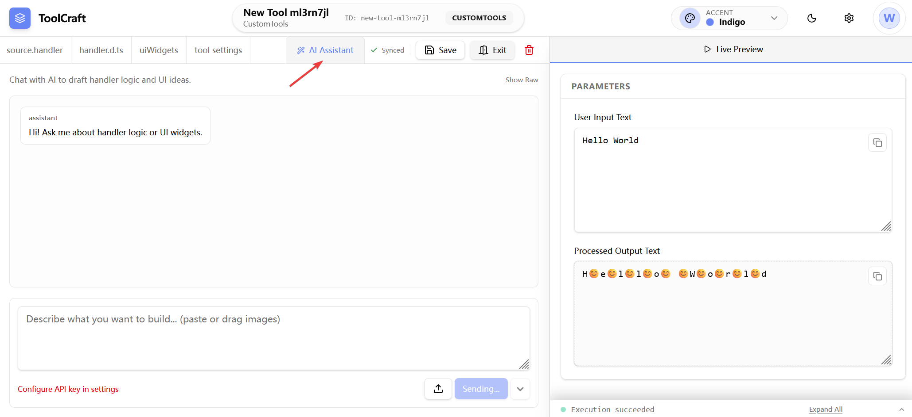
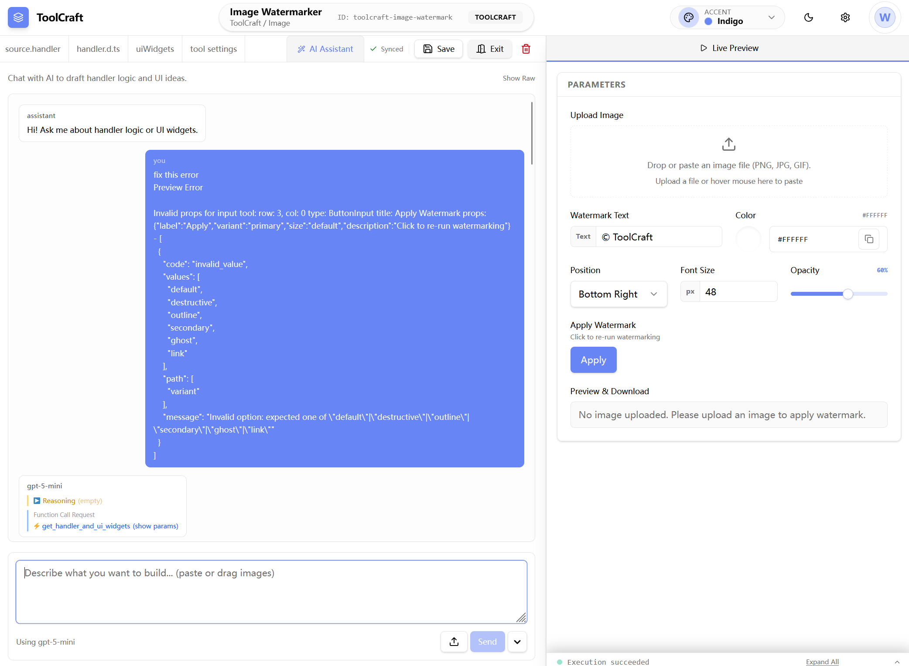

# Using AI to Create Tools

:::note
Before reading this article, you should first read [Basic Concepts](baseic-concepts.md) and [A Simple Tool Sample](a-simple-sample.md) to understand the composition of a tool.
:::

Creating tools can be a tedious process. You need to define the uiWidgets JSON and handler function code, then repeatedly modify and debug until you achieve the desired functionality.

While implementing simple features doesn't take too long, the process becomes very time-consuming and tedious as the functionality grows more complex.

This is where you can leverage the help of an LLM to generate tools for you.

## AI Assistant Panel and Configuration

After entering tool edit mode, you can see an `AI Assistant` button on the right side of the editor. Click it to expand the AI Assistant panel.

Before you start using the AI Assistant panel, you need to configure your OpenAI API Key, API URL, and Model information.

:::note
Currently, only LLM providers compatible with the OpenAI API interface are supported.
:::

Click the gear button in the top-right corner of the AI Assistant panel, then configure your OpenAI API Key in the settings panel that appears.

:::warning
Whether or not you are logged in, your API KEY is stored only in the browser and will never be uploaded to the server.

This is to ensure the security of your API KEY.

This also means that you will need to reconfigure your OpenAI API Key whenever you switch browsers.
:::

## Using AI Assistant to Create Tools

After configuring the API KEY, you can create the tools you need by chatting with the LLM. For example, if you want to create a tool that adds a watermark to an image:

You can type the following in the text input:

> Create a tool to let user upload an image, and print a watermark at a specific position. User can specify the watermark's color, text, and position.

Then after a lengthy wait, boom — the tool is magically generated. The LLM will automatically generate the `uiWidgets`, `handler`, and tool meta information in `Settings` for you.

Of course, the tool generated in one go may not be entirely correct. You can continue chatting with the LLM to modify and optimize the tool experience.

## Potential Issues with LLM-Generated Tools

### Invalid uiWidgets JSON Definition

Depending on the LLM model's capabilities, generated tools may have various issues. The most common one is invalid component definitions in the generated uiWidgets JSON.

When this happens, you will see an error like this:

The fix is straightforward — simply copy the error message into the input box and ask the LLM to fix the error. If the error persists, retry multiple times until it succeeds.

### Handler Runtime Errors
Another common error with AI-generated tools is runtime exceptions in the handler code.

When a handler error occurs, the LogPanel at the bottom of the tool interface will show an execution failure. Click on the LogPanel to view the error details.
Copy the error message into the input box and ask the LLM to fix the error.

:::warning
Due to the inherent instability of LLMs and model capability limitations, you may encounter situations where the LLM cannot fully fix the error no matter what.

In such cases, consider the following solutions:

- Try switching to a different model. Note that a larger model doesn't always produce better results — experiment with various models to see what works best.
- A common issue when LLMs handle code is that they often miss the key point and make incorrect code worse with each iteration. If multiple attempts still fail to fix the error, you can simply reset the entire tool code and start generating the tool from scratch.
:::

## AI Model Performance

Larger models tend to produce better results. Based on my testing, `gpt-5-mini` occasionally generates tools with errors, but generally handles simple tool generation well.

Experiment with different models based on your specific needs to find the LLM model that works best for you.

## How Tool Generation Works: Prompt Engineering

The reason ToolBake supports tool generation so effectively is that we have carefully designed the prompts.

ToolBake automatically provides the LLM with all the information about how tools work, including the structure of `uiWidgets`, `handler`, and other details.

You can view the full conversation between the system and the LLM by clicking the `Show Raw` button in the `AI Assistant` panel to see the exact prompts generated.

Or check out this [page](../prompt-engineering/user-tool-prompt.md) to see the full prompt details.

